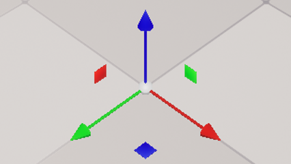
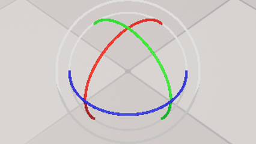
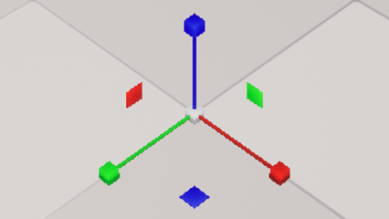
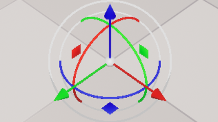
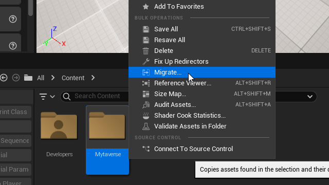
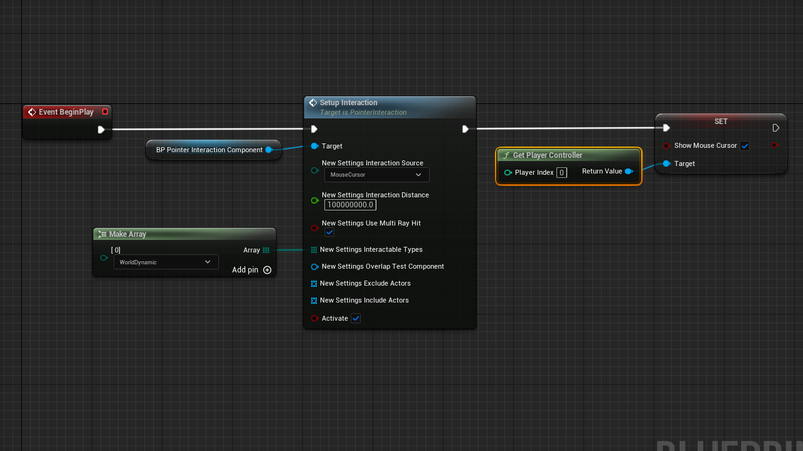
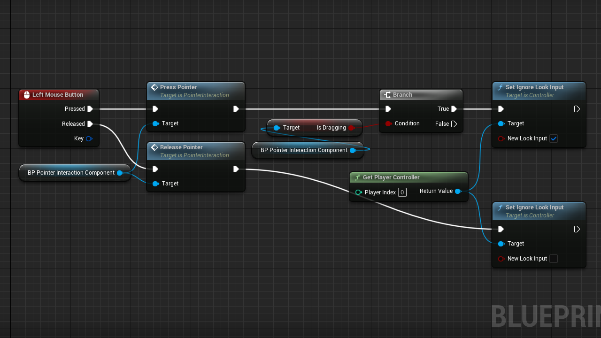
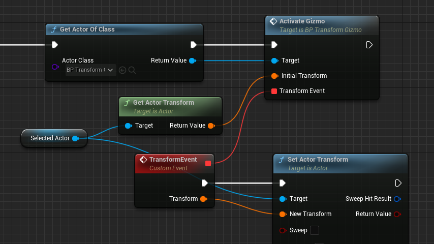
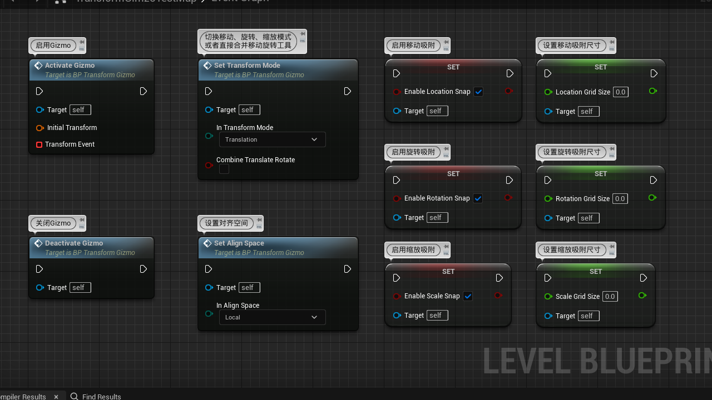

# UE5RuntimeTransformGizmo

## Preview
  
  
  
  

## Basic Usage
1. Open this project and right click the "Mytaverse" folder in the content browser, select to migrate to your project's content  
  

2. Open the Pawn(or Character) Blueprint used by your project (You can only use it in blueprints since it's a pure blueprint feature), and then add a component called "Pointer Interaction"  

3. 在Pawn蓝图的BeginPlay事件逻辑后面调用PointerInteraction组件的SetupInteraction节点，同时调用PlayerController的SetShowMouseCursor来显示鼠标  

    - InteractionSource 参数要设为MouseCursor，启用鼠标交互
    - InteractionDistance 表示鼠标交互距离，一般设置一个比较大的距离
    - UseMultiRayHit 这个必须启用
    - InteractionTypes 要设置为WorldDynamic
    - Activate 这个地方勾选才能启用交互功能

4. 在Pawn蓝图中添加LeftMouseButton事件并接入PointerInteraction组件的PressPointer和ReleasePointer方法

    - 如果鼠标悬停在TransformGizmo上时，按下鼠标左键后会进入拖拽状态，这个时候我们一般不希望视角发生变化。  
    我这里判断PointerInteraction进入拖拽状态之后，就调用PlayerController的SetIgnoreLookInput来禁用视角控制，在鼠标松开之后在启用视角控制。

5. 在需要显示并启用Gizmo的地方，只需要对BP_TransformGizmo对象调用ActivateGizmo就可以了，当然需要先在场景里放置或生成一个BP_TransformGizmo对象  
  
    - ActivateGizmo方法的InitialTransform表示显示Gizmo时候的初始Transform，一般在对一个Actor启用Gizmo的时候要把该Actor的Transform传入
    - TransformEvent会在拖拽Gizmo的时候持续调用并传出当前计算得到的Transform结果，这个结果可以根据需要来使用

6. 控制函数列表

## 其他
- UE5其实已经内置这个功能了，可以运行时使用，可以在引擎的[InteractiveToolsFramework](https://github.com/EpicGames/UnrealEngine/tree/release/Engine/Source/Runtime/InteractiveToolsFramework)模块中找到相关代码  
  
[参考文章1](https://www.gradientspace.com/tutorials/2022/6/1/the-interactive-tools-framework-in-ue5)  
[参考文章2](https://www.gradientspace.com/tutorials/2021/01/19/the-interactive-tools-framework-in-ue426)

